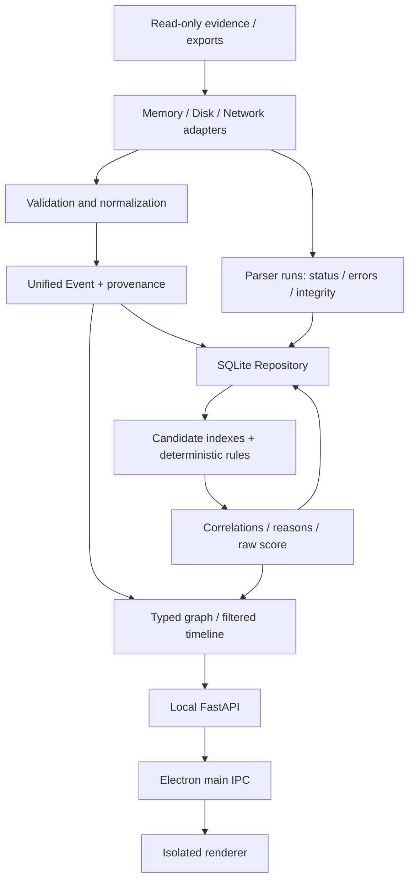

# EvidenceMesh v0.3 architecture

EvidenceMesh reads existing evidence and external tool exports, normalizes observations, and builds deterministic correlations. It does not acquire memory, execute recovered content, or call an AI API.

## Module boundaries

| Component | Contract and responsibility |
|---|---|
| MemoryImportAdapter | Volatility JSON exports + ArtifactContext → ImportBatch; delegates the original five plugins to the preserved Volatility3Adapter |
| DiskArtifactAdapter | Explicit artifact kind + raw/export path → validated records and Events |
| PcapAdapter | Offline PCAP/PCAPNG → tshark field output → flow/protocol Events |
| EvidenceReader | Read-only integrity, strict JSON/CSV, source references, UTC interpretation |
| ImportService | Case manifest/subset routing, per-parser status, atomic batch persistence |
| Normalizer | Canonical Event validation, UTC, IP, host/domain and protocol normalization |
| EventIndex | Semantic postings and time buckets; deterministic candidate pairs |
| Rules | Event pair → field-backed positive/negative reasons, without parser I/O |
| Repository | Case isolation, migrations, indexed queries, revision-safe persistence |
| GraphBuilder | Recorded entity relationships and calculated Event correlations |
| API / CLI / Desktop | Transport and presentation over the same import/analysis services |

Parser code does not depend on the correlation engine. Configured parser facades preserve the existing collector protocol. No-context legacy facades still fail explicitly; they are not advertised as operational parsers. See [parser support](PARSER_SUPPORT.md).

## Evidence and identity

Acquisition ID and an aware extraction timestamp are required for artifact imports. Missing event time uses explicit `extraction_time` semantics, which earns no temporal score. Export hashes identify export bytes; recovered content hashes identify recovered bytes. Neither is substituted for an unknown memory-image hash.

A process identity includes acquisition scope, PID and available creation/address observations. The original process merge policy remains conservative about reused PIDs and ambiguous owners. Independent memory and disk process observations can bridge only with matching known host, PID and creation time. Recorded lifetimes reject impossible associations. File-object addresses require a shared acquisition scope; MFT references require host, volume, record and sequence.

Paths remain evidence strings. Comparison uses Windows lexical normalization, not analyst filesystem resolution. Device aliases, environment variables and volume mappings are not guessed.

## Storage

SQLite `user_version=1` migrates to **3** additively. Existing cases and serialized Event JSON survive unchanged. Unknown database versions, including an unrecognized version 2, are rejected.

Tables: `cases`, `evidence_sources`, `events`, `imports`, `parser_runs`, `correlations`, `correlation_reasons`, `entities`, `graph_nodes`, `graph_edges`. Event columns index case, time, source, PID, type, artifact type, normalized path, hash, IP and domain. Full models remain JSON; denormalized columns support selection.

WAL, foreign keys, busy timeout and per-operation connections remain. Imports are atomic; duplicate IDs cannot overwrite prior observations. Artifact import failure retains failed run records. New evidence invalidates derived analysis. Analysis commits compare evidence revisions under a transaction. Full-case graph projections can be persisted; root-scoped projections are computed. Historical correlation run versions are not retained.

## Correlation and graph

Default rules use indexed candidates rather than all Event pairs. Full network tuples do not fan out through a shared DNS/server endpoint. Host, identity, path, hash, reference, domain/client and time constraints narrow candidates before scoring. Custom rule lists retain the legacy all-pairs extension contract; dense genuine identity groups can still have quadratic output.

Related evidence follows correlation edges from the selected root. Sharing an IP entity alone does not expand the component. Graph observations and correlations are distinct: an observed relationship's score 100 means the relationship is explicitly recorded, not statistical certainty. Repeated entity edges coalesce with support counts and all source-event/provenance references. Direct correlation edges retain their own reasons.

## Desktop and deployment

The original black/dark-gray/red layout is preserved. Electron main talks to a separate loopback API; preload exposes bounded IPC. Renderer Node access is disabled, context isolation and sandboxing are enabled, navigation is restricted, and evidence strings use textContent. External parsers use argument arrays, timeouts and captured exit/stderr.

Tables render 100 rows per page. Event requests load in 2,000-record chunks, but the complete selected case is still held in renderer memory. Graph display limits are 200 nodes/400 edges with an explicit notice. Backend 100k-event performance does not establish 100k-event UI performance.

The generated Linux ARM64 application requires a separately running Python backend and installed external tools. Python embedding, signed installers, Windows/macOS validation and advanced graph layout remain outside validated support.
